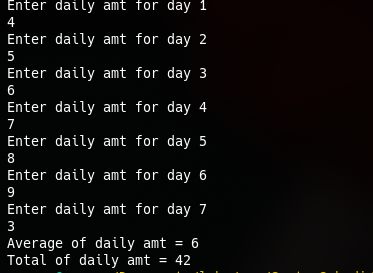
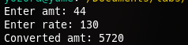
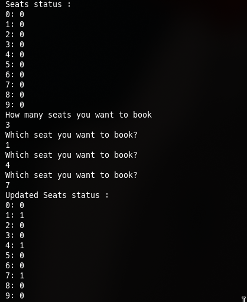
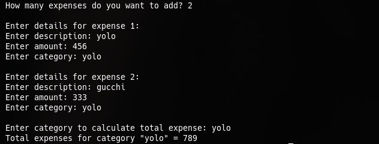

* LAB 2: Basics of C++

** Discussion:
 From this lab, we are able to learn the basics of C++ programing.

 The basics of C++ is very similar to C, as we observed in this lab, mos data structure like arrays & structs are same as in C

 Here is the output of the lab code:

 [[./labw/task1.cpp ][task1:]]

 

 [[./labw/task2.cpp ][task2:]]

 [[./output2.png]]

 [[./labw/task3.cpp ][task3:]]

 

 [[./assign/assign1.cpp][assign1:]]

 

 [[./assign/assign2.cpp ][assign2:]]

 [[./output5.png]]

 [[./assign/assign3.cpp][assign3:]]

 

 [[./labw/task4.cpp ][task4:]]

 [[./output7.png]]

** Conclusion:
From this lab, we are able to conclude that the basics of C++ & C are very similar, and the main difference in extra features added in top of C's existing ones.
