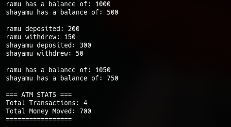
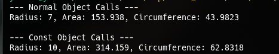
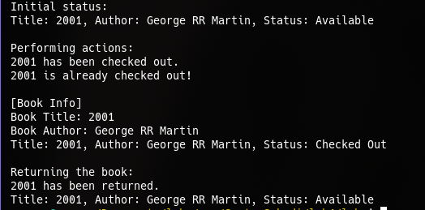
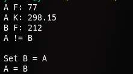

* LAB 4: Constructors and Destructors C++

** Discussion:
 From this lab, we are able to learn the uses of static and const keywords in C++.

 Here is the output of the lab code:

 [[./labw/task1.cpp ][task1:]]

 

 [[./labw/task2.cpp ][task2:]]

 

 [[./labw/task3.cpp ][task3:]]

 

 [[./labw/task4.cpp ][task4:]]

 

 [[./labw/task4.cpp ][task5:]]

 

** Conclusion:
From this lab, we were able to conclude that static and const keywords can be used to retain certain values within two or more classes but only static values can be modified during runtime
