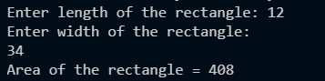

## Program Execution Outputs

<table>
  <tr>
    <td align="center">
      <b>Lab 1: Basic Structure</b> 
       
      <i>Output of LAB_1.cpp</i>
    </td>
    <td align="center">
      <b>Lab 1b: Standard I/O</b> 
       
      <i>Output of LAB_1b.cpp</i>
    </td>
    <td align="center">
      <b>Lab 1c: Loop Operations</b> 
       
      <i>Output of LAB_1c.cpp</i>
    </td>
  </tr>
</table>
